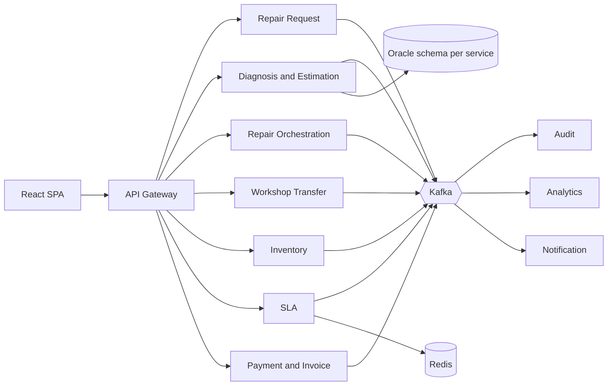

# Container architecture (future)

```mermaid
flowchart LR
  SPA[React SPA] --> GW[API Gateway]
  GW --> RR[Repair Request] & DE[Diagnosis and Estimation] & RO[Repair Orchestration] & WT[Workshop Transfer] & INV[Inventory] & SLA[SLA] & PAY[Payment and Invoice]
  RR & DE & RO & WT & INV & SLA & PAY --> K{{Kafka}}
  K --> AUD[Audit] & AN[Analytics] & N[Notification]
  DE --> DB1[(Oracle schema per service)]
  SLA --> R[(Redis)]
```
Every service owns its schema; see `database-design.md`.
