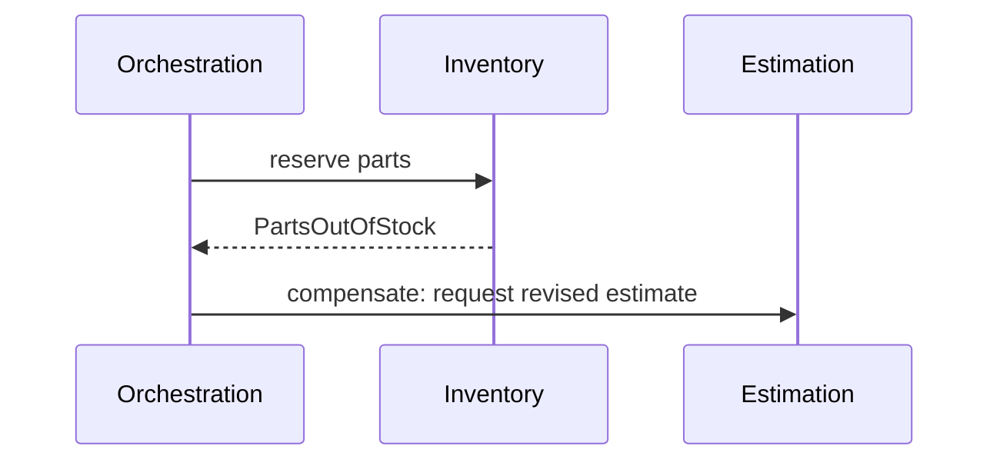

# Data consistency
Eventual consistency via transactional outbox, idempotent consumers, optimistic locking (`ROW_VERSION`) and saga compensation.

```mermaid
sequenceDiagram
  Orchestration->>Inventory: reserve parts
  Inventory-->>Orchestration: PartsOutOfStock
  Orchestration->>Estimation: compensate: request revised estimate
```
