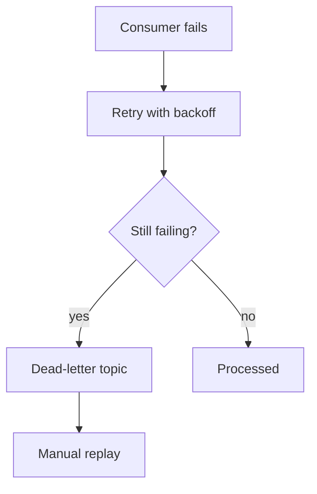

# Failure recovery (proposed)

```mermaid
flowchart TD
  F[Consumer fails] --> R[Retry with backoff] --> D{Still failing?}
  D -->|yes| DLQ[Dead-letter topic] --> M[Manual replay]
  D -->|no| OK[Processed]
```
Circuit breakers on provider calls; outbox relay is restart-safe; consumers deduplicate by event ID.
