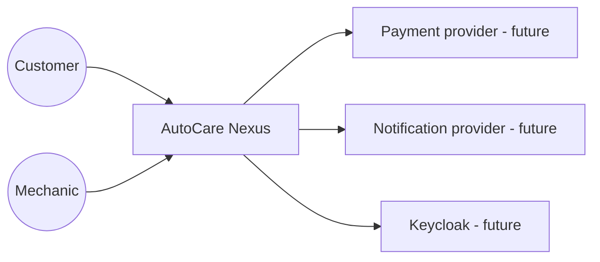

# System context
> Status: **proposed future backend**. The implemented app is a static, frontend-only simulation.

```mermaid
flowchart LR
  Customer((Customer)) --> Nexus[AutoCare Nexus]
  Mechanic((Mechanic)) --> Nexus
  Nexus --> Pay[Payment provider - future]
  Nexus --> Notif[Notification provider - future]
  Nexus --> KC[Keycloak - future]
```
